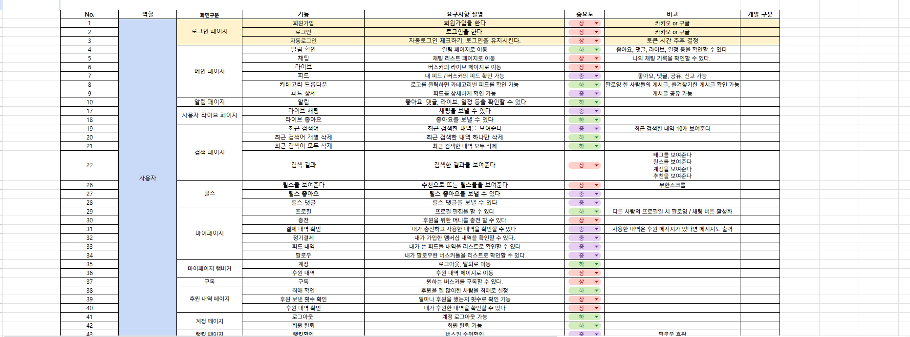
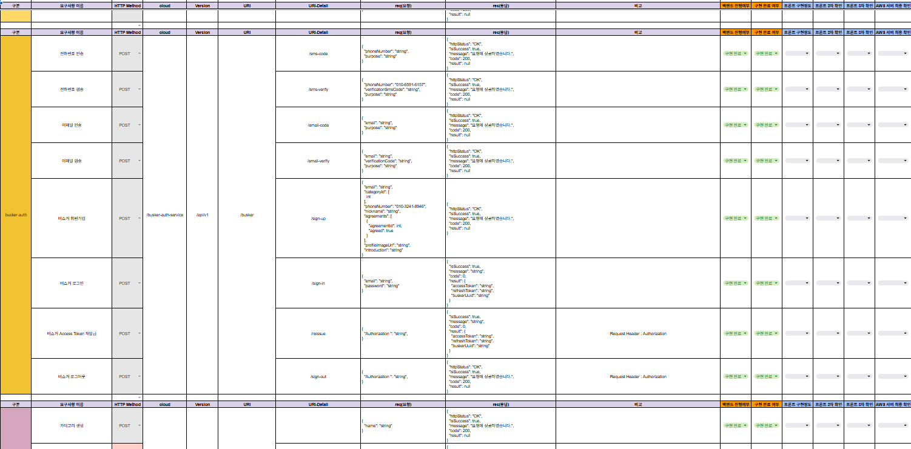
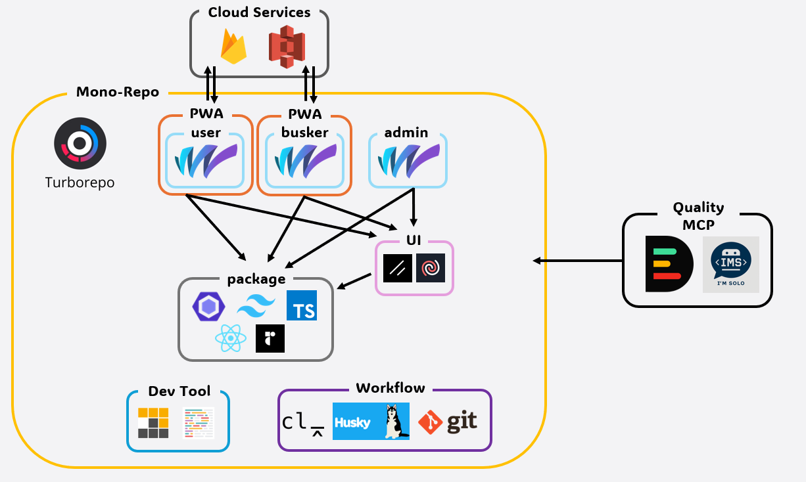
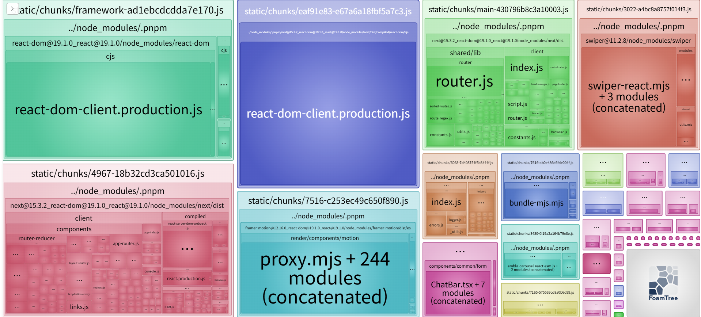
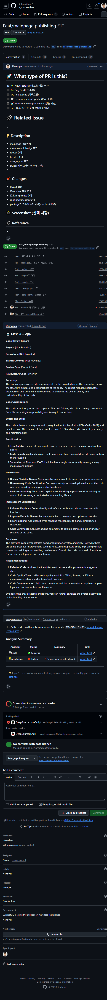

# VYBZ

<table align="center">
  <tr>
    <td align="center">
      
    </td>
    <td align="center">
      
    </td>
  </tr>
</table>

> 🎤 팬과 버스커가 함께 만드는 무대, 실시간 소통 기반 팬 플랫폼 SNS
>
> 📅 개발 기간 : 2025년 5월 2일 ~ 2025년 7월 15일
>
> 🌐 배포 URL(User) : [VYBZ](https://vybz.kr/)
>
> 🌐 배포 URL(Busker) : [VYBZ Busker](https://busker.vybz.kr/)
>
> 🌐 배포 URL(Admin) : [VYBZ Admin](https://admin.vybz.kr/)

## 목차

1. [기획 의도 및 기대 효과](#1-기획-의도-및-기대-효과)
2. [개발 환경](#2-개발-환경)
3. [주요 기능](#3-주요-기능)
4. [설계 문서](#4-설계-문서)
5. [기술 소개](#5-기술-소개)

   5-1. [Turborepo](#5-1-turborepo)

   5-2. [공통 설정 패키지](#5-2-공통-설정-패키지)

   5-3. [협업과 품질 자동화](#5-3-협업과-품질-자동화)

   5-4. [GitHub MCP](#5-4-github-mcp)

6. [트러블 슈팅](#6-트러블-슈팅)
7. [프로젝트 규칙](#7-프로젝트-규칙)
8. [Vybz 프론트엔드 포팅 매뉴얼](#8-vybz-프론트엔드-포팅-매뉴얼)

## 1. 기획 의도 및 기대 효과

- 버스킹 프로그램으로 인한 버스킹 문화에 대한 관심 증가
- 버스킹 공연 홍보 공간의 부재 / 버스킹 홍보의 어려움
- 이러한 문제점들을 해결하기 위한 생태계를 만들기 위해 VYBZ 프로젝트를 시작했습니다.

[🔝 목차로 돌아가기](#목차)

## 2. 개발 환경

### 공통 패키지

| 이름                 | 버전         | 설명                          |
| -------------------- | ------------ | ----------------------------- |
| turbo                | 2.5.3        | 모노레포 빌드 시스템          |
| pnpm                 | 8.15.6       | 패키지 매니저                 |
| Node.js              | >=18         | JavaScript 런타임             |
| tailwindcss          | 4.1.5        | CSS 프레임워크                |
| tailwind-merge       | 3.3.0        | Tailwind 클래스 병합 유틸리티 |
| tailwindcss-animate  | 1.0.7        | Tailwind 애니메이션 플러그인  |
| clsx                 | 2.1.1        | React 컴포넌트 조합 유틸리티  |
| prettier             | 3.5.3        | 코드 포매터                   |
| husky                | 9.1.7        | Git 훅 관리                   |
| commitlint/cli       | 19.8.1       | 커밋 메시지 검증 도구         |
| eslint-config        | workspace:\* | ESLint 설정 공유 패키지       |
| tailwind-config      | workspace:\* | Tailwind 설정 공유 패키지     |
| typescript-config    | workspace:\* | TypeScript 설정 공유 패키지   |
| next/bundle-analyzer | 15.3.3       | 빌드 성능 분석 도구           |

### **앱별 상세 개발 환경**

- [User 앱 개발 환경 보기](./apps/user/README.md)
- [Busker 앱 개발 환경 보기](./apps/busker/README.md)
- [Admin 앱 개발 환경 보기](./apps/admin/README.md)

[🔝 목차로 돌아가기](#목차)

## 3. 주요 기능

|                                          로그인/메인 페이지/마이페이지                                           |                                                   버스커페이지                                                   |
| :--------------------------------------------------------------------------------------------------------------: | :--------------------------------------------------------------------------------------------------------------: |
|  |  |

|                                                   버스커페이지                                                   |                                          검색페이지/라이브 목록 페이지                                           |
| :--------------------------------------------------------------------------------------------------------------: | :--------------------------------------------------------------------------------------------------------------: |
|  |  |

|                                                   팔로우페이지                                                   |                                                    충전페이지                                                    |
| :--------------------------------------------------------------------------------------------------------------: | :--------------------------------------------------------------------------------------------------------------: |
|  |  |

|                                            라이브 방송페이지                                             |                                                방송페이지                                                |
| :------------------------------------------------------------------------------------------------------: | :------------------------------------------------------------------------------------------------------: |
|  |  |

|                                             1:1 채팅 페이지                                              |                                              결제/정기결제                                               |
| :------------------------------------------------------------------------------------------------------: | :------------------------------------------------------------------------------------------------------: |
|  |  |

[🔝 목차로 돌아가기](#목차)

## 4. 설계 문서

### 시스템 아키텍쳐


### CI/CD 아키텍쳐


### ERD 설계


### 요구사항 정의서



### API 명세서



[🔝 목차로 돌아가기](#목차)

## 5. 기술 소개

### 5-1. Turborepo



- 모노레포 빌드 시스템
- 앱/패키지 간 의존성 효율적으로 관리
- 빌드 캐싱으로 속도를 높임

### 5-2. 공통 설정 패키지

- ESLint/TypeScript/Tailwind Config 등 개발 규칙/설정 공유
- UI 라이브러리 공유해서 재사용성을 높임

### 5-3. 협업과 품질 자동화

#### 5-3-1. Husky

- `pnpm install` 시 자동으로 설치됨 (package.json의 "prepare" 스크립트)
- 커밋 전 린트와 타입 체크 자동 실행 (pre-commit hook)
- 변경된 파일만 타겟팅하여 `pnpm run check-before-commit` 실행
- Commitlint로 커밋 메시지 형식 검증 (commit-msg hook)
- 커밋 메시지 규칙은 `commitlint.config.js` 파일에 정의되어 있으며 반드시 확인 필요
  - 허용된 타입: feat, fix, docs, refactor, chore, design, hotfix, test, wip
  - 메시지 형식: `<타입>: <제목>` (예: `feat: 로그인 기능 구현`)
  - 최대 길이: 50자


#### 5-3-2. PNPM

- 빠르고 효율적인 패키지 매니저로 채택하여 워크스페이스 관리

#### 5-3-3. Prettier

- 코드 스타일 컨벤션 자동 적용 (포매팅 일관성 유지)

#### 5-3-4. ESLint

- 코드 품질 및 스타일 자동 검사 (문법/버그/스타일 이슈 사전 탐지)

#### 5-3-5. Analyzer

- 빌드 성능 분석
- 빌드 시간 최적화를 위한 성능 분석



### 5-4. GitHub MCP

#### 5-4-1. DeepSource AI

- 코드 분석 및 자동 리뷰
- AI 기반으로 버그, 취약점, 코드 품질 문제를 PR 단계에서 사전 감지

#### 5-4-2. IMS

- 코드 분석 및 자동 리뷰
- AI 기반으로 시멘틱 태그 품질을 PR단계에서 검사

- [User 앱 기술 소개 보기](./apps/user/README.md)
- [Busker 앱 기술 소개 보기](./apps/busker/README.md)




[🔝 목차로 돌아가기](#목차)

## 6. 트러블 슈팅

### 1️⃣ Turbo 명령어 에러 이슈

- **문제**: 윈도우에서 리눅스 Turbo 명령어 실행 시 Git 변경 사항을 제대로 감지하지 못하는 OS 간 호환성 문제 발생
- **해결**: package.json에 명령어를 정적으로 작성하여 해결. 예를 들어 `--filter=...[origin/dev]`와 같은 형태로 특정 브랜치 기준 변경사항 필터링 명령어를 정적으로 작성

### 2️⃣ Husky의 pnpm 인식 오류 이슈

- **문제**: pnpm에서 오류 발생 시 종료 코드 1을 반환하지만, Husky가 이를 0으로 인식하여 오류가 발생해도 커밋/푸시가 통과되는 문제 발생
- **해결**: 커스텀 Husky 스크립트(.husky/pre-commit, .husky/pre-push)를 작성하여 종료 코드를 명시적으로 검사하고 적절한 오류 메시지 표시
  - 커밋 전: `pnpm run check-before-commit`로 변경된 파일만 린트/타입체크 실행
  - 푸시 전: `pnpm run check-before-push`로 변경된 패키지만 빌드 검사

### 3️⃣ Tailwind JIT 이슈 해결

- **문제**: 모노레포에서 Tailwind JIT 기능으로 인해 컴포넌트 라이브러리의 클래스가 사용 전까지 출력되지 않는 문제 발생
- **해결**: Tailwind CSS 4의 새로운 기능을 활용하여 해결
  - `@source` 디렉티브: 특정 폴더/파일의 클래스를 포함하도록 명시적 지정
  - `@theme` 디렉티브: 테마 변수 정의 및 동적 테마 관리 지원

- [User 앱 트러블 슈팅 보기](./apps/user/README.md)
- [Busker 앱 트러블 슈팅 보기](./apps/busker/README.md)

[🔝 목차로 돌아가기](#목차)

### 7. 프로젝트 규칙

#### 📍 Google Docs

프로젝트의 전반적인 내용과 작업 과정등을 google docs에 담아서 관리.
[🔗 Google Docs](https://github.com/user-attachments/files/19932522/6.1.4.pdf)
<br/>

#### 📍 Notion 회고

- 팀 노션에 동시 접속하여 [🔗 일일 회고](https://www.notion.so/1e59f61cd9ee81c9bef8f4694bc5a484)를 진행하고 진행사항을 파악.


<br/>

#### 📍 Frontend 프로젝트 구조

```jsx
frontend.vybz/
├── apps/
│   ├── user/                             # 일반 사용자용 앱
│   │   ├── app/                          # Next.js 15 app 디렉토리
│   │   ├── components/
│   │   ├── public/
│   │   ├── next.config.js
│   │   ├── tsconfig.json
│   │   └── package.json
│   │
│   ├── busker/                         # (선택) 버스커용 앱
│   └── admin/                          # (선택) 관리자용 앱
│
├── packages/
│   ├── ui/                             # 공통 UI 컴포넌트 패키지
│   ├── typescript-config/             # tsconfig 설정 공통화
│   └── eslint-config/                 # eslint 설정 공통화
│
├── .gitignore
├── .prettierrc
├── .prettierignore
├── pnpm-workspace.yaml
├── turbo.json
├── package.json
└── pnpm-lock.yaml
```

#### 📍 Frontend 코드 컨벤션

- **한 줄에 최대 80자까지만 작성**
- **함수명, 폴더명은 카멜케이스로 작성** (ex. userIdtabWidth)
- **tabWidth: 들여쓰기 간격은 2칸, 들여쓰기에 공백(space)을 사용**
- **문장 끝에 항상 세미콜론(;)**
- **singleQuote: 문자열은 항상 '홑따옴표'로 작성**
- **quoteProps: 객체 속성에 일관되게 따옴표를 사용**
- **bracketSpacing: 중괄호 사이에 띄어쓰기 사용**
- **trailingComma: 마지막 항목에도 쉼표 (ES5 기준)**
- **arrowParens: 화살표 함수의 매개변수는 항상 괄호**
- **endOfLine: 개행은 LF(Line Feed) 방식 사용**
- **jsxBracketSameLine: JSX의 닫는 괄호는 다음 줄에 위치**
- **jsxSingleQuote: JSX 안에서는 "쌍따옴표"를 사용**
- **htmlWhitespaceSensitivity: HTML 공백 민감도는 CSS 기준으로 설정**

#### 컴포넌트 관련

- **interface: 객체 구조 정리, type: 변수, 함수 반환 값, 매개 변수**
- **type은 대문자로 시작**
- **var 절대 금지, const 지향**
- **컴포넌트 화살표 함수 사용 금지**
- **컴포넌트 내부 상태 & props 최대 5개 이내**
- **최대한 서버 컴포넌트로 제작**
- **하나의 컴포넌트는 하나의 기능만 하도록 지향**
- **Tailwind 100% 사용**
- **데이터 패치는 최대한 page.tsx(패칭 함수는 sevices/)**

#### API 호출 관련

- **fetch 추상화. 직접 호출 지양**
- **클라이언트 컴포넌트에서는 fetch 직접 호출 금지**

[🔝 목차로 돌아가기](#목차)

## 8. Vybz 프론트엔드 포팅 매뉴얼

### 시작하기 전에

이 프로젝트는 **pnpm**을 패키지 매니저로 사용합니다. npm이나 yarn을 사용할 경우 의존성 해결에 문제가 발생할 수 있습니다.

#### 필수 요구사항

- Node.js 버전 18 이상
- pnpm 버전 8.15.6 이상

### 설치 방법

1. 저장소를 클론합니다:

```sh
git clone [저장소 URL]
cd vybz
```

2. pnpm을 설치합니다 (아직 설치되지 않은 경우):

```sh
npm install -g pnpm
```

3. 의존성을 설치합니다:

```sh
pnpm install
```

### 빌드 순서

이 프로젝트는 모노레포 구조로 구성되어 있어 빌드 순서가 중요합니다. 특히 패키지 빌드가 먼저 이루어져야 앱이 제대로 작동합니다.

#### 빌드 순서 의존성

1. **패키지 빌드** (가장 먼저 빌드되어야 함):

   - @repo/typescript-config
   - @repo/eslint-config
   - @repo/tailwind-config
   - @repo/ui

2. **앱 빌드** (패키지 빌드 후 진행):
   - apps/admin
   - apps/busker
   - apps/user

> **중요**: 패키지에서 dist 폴더가 생성되지 않으면 앱들이 의존성을 해결하지 못합니다.

### 개발 명령어

```sh
# 전체 프로젝트 개발 모드 실행
pnpm dev

# 특정 앱만 개발 모드 실행
pnpm --filter "[앱이름]" dev
# 예: pnpm --filter "apps/user" dev

# 전체 프로젝트 빌드
pnpm build

# 의존성 그래프 생성 (graph.png 생성)
pnpm graph

# 타입 체크
pnpm check-types

# 린트 검사
pnpm lint


```

### 환경 변수

프로젝트는 환경 변수를 사용합니다:
각 앱의 루트 디렉토리에 `.env` 또는 `.env.local` 파일을 생성하여 필요한 환경 변수를 설정하세요.
환경 변수 목록은 각 앱의 루트 디렉토리의 README.md 파일을 참고하세요.

### 더 자세한 정보

의존성 관계에 대한 시각적 이해가 필요하면 `pnpm graph` 명령어로 생성된 `graph.png` 파일을 참조하세요.
